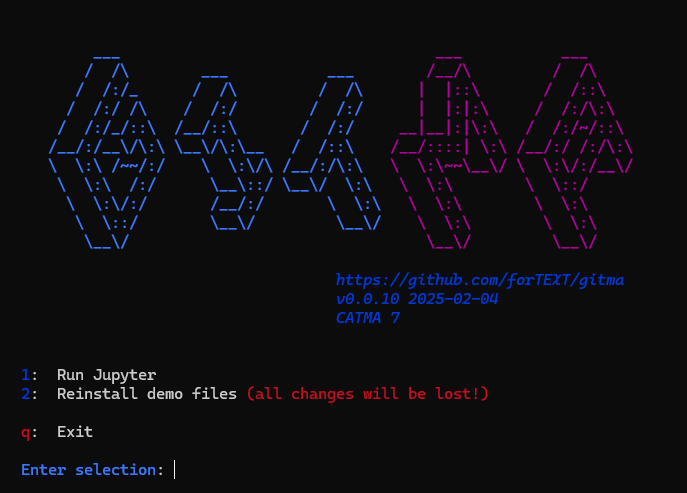
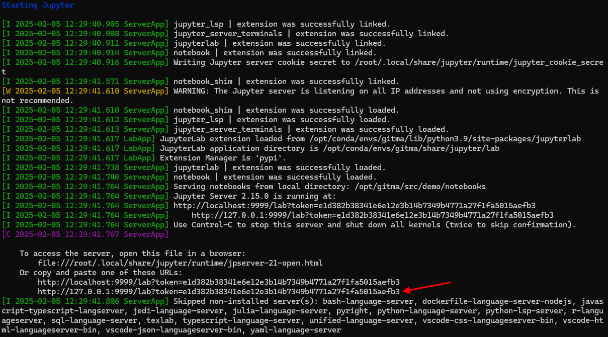

# GitMA Docker Image

We have created a ready to use Docker image that includes GitMA and all dependencies, as well as demo Jupyter Notebooks.

Its purpose is to make it easy for you to try out the demo notebooks, so that you can see what GitMA can do. You can even load your own CATMA projects! However,
if you want to work with GitMA more seriously, for example to create and upload gold annotations back to CATMA, you should consider installing GitMA directly in
a local Python environment.

This image should work for all amd64 and arm64 machines: [maltem/gitma-demo](https://hub.docker.com/r/maltem/gitma-demo)

## Prerequisites

You will need to download and install the Docker Desktop application: https://www.docker.com/products/docker-desktop/  
(ignore the button to choose a plan and scroll down the page to find the download button)

## Usage

To **fetch the image**, execute the following in your terminal / command prompt:  
`docker pull maltem/gitma-demo:latest`

To **start the container the first time**, execute the following in your terminal / command prompt (this will fetch the image if you don’t already have it):  
`docker run -it --publish 127.0.0.1:9999:9999 --name gitma-demo maltem/gitma-demo:latest`

To **start the container again at a later stage**, execute the following in your terminal / command prompt:  
`docker start -ai gitma-demo`

Upon starting the container you should see the following menu:  


Choose option 1 to start the Jupyter server. Use the final link that is displayed in the output:  


Once you can see the JupyterLab interface in your browser, simply double-click on one of the notebooks in the list on the left to open it. We recommend that you
start with `load_project_from_gitlab`, followed by `explore_annotations`. (We assume that you know what Jupyter Notebooks are and how to navigate them. If not
you will find plenty of tutorials online.)

To **stop the Jupyter server**, within the terminal / command prompt, press `CTRL/CMD + C` twice in a row. This will take you back to GitMA's main
menu.

If you choose the option to exit from the main menu the container will be stopped. You can start it again as shown at the top of this section.

## Updates

We may publish updated versions of the Docker image from time to time. To get the latest version, simply re-run the `docker pull` command as shown at the top of
the *Usage* section. The output of the command will tell you if anything new was fetched.

To start a container using a new version, execute the same `docker run` command as shown at the top of the *Usage* section, but change the name after `--name`
as you already have a container named "gitma-demo". Alternatively you can simply delete the old container first, but make sure that it doesn't contain anything
you want to keep! Read on to find out how to delete a container (and to learn a bit more about Docker in general).

## More about Docker

Here is a quick crash-course on some Docker terminology and commands.

### Images and Containers

In layman's terms, you can think of a Docker image as a recipe for a cake, and a container as a cake that you bake using that recipe.

The recipe (the image) includes all the required ingredients (code, dependencies and configuration) and instructions that are needed to bake the cake. It can be
shared, allowing anyone to bake the same cake exactly as described. Unlike a real recipe, an image is just a blueprint and is unchangeable (but there can be new
versions of it!).

The cake (the container) is made from the recipe. When you "run" a Docker image, you create a container. You can create multiple containers from the same image,
and each one works independently of the others. A container is therefore a running instance of the image blueprint - it is active and modifiable.

### Common Commands

Apart from those listed in the *Usage* section, here are some common commands to work with images and containers in the terminal / command prompt. Note that all
of these actions can also be performed using the Docker Desktop application interface.

```
docker ps -a                        # lists all containers, running or not
docker stop <container-name-or-id>  # stops a running container
docker rm <container-name-or-id>    # deletes a container

docker images                       # lists all images
docker rmi <image-name-or-id>       # deletes an image
```
